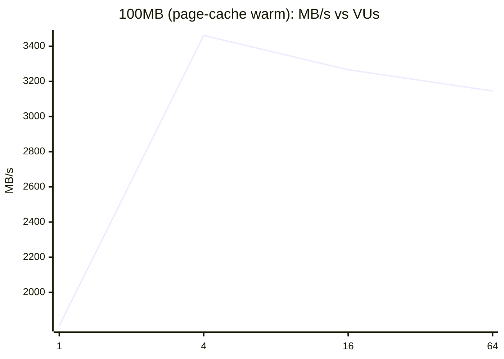
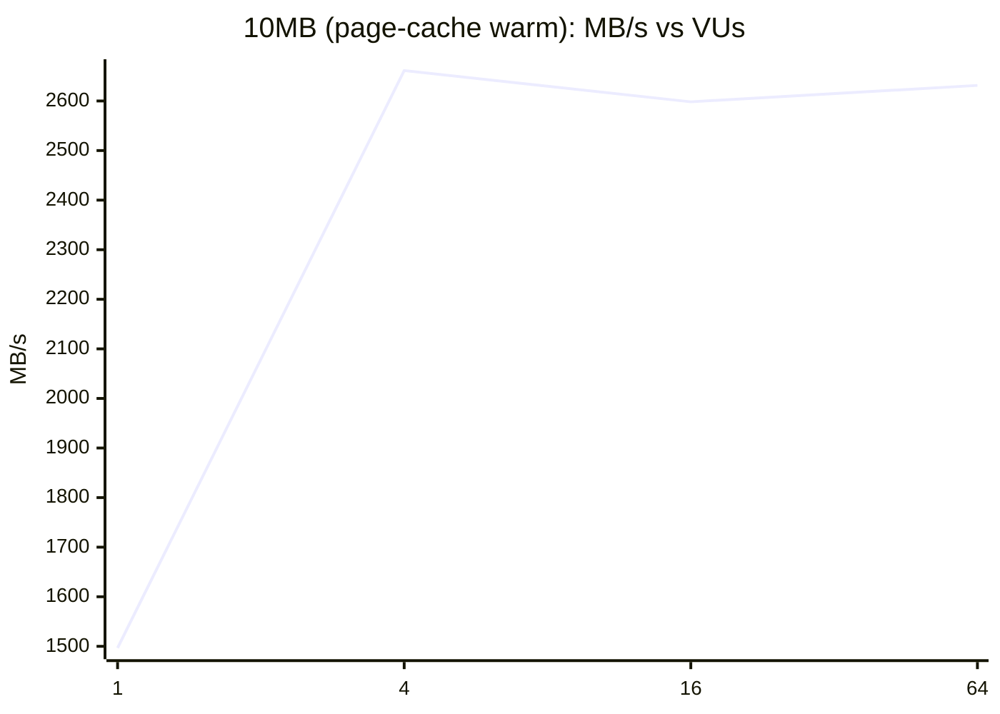
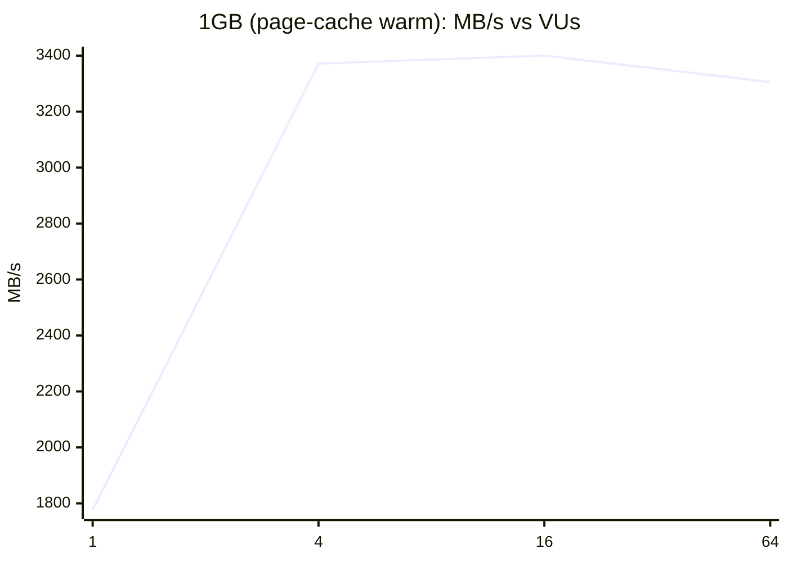

# zot warm-cache throughput report

- zot: v2.1.21-0-g6429ce6  config sha256: 2dd1a2f085a15e5fb689ce97260402a89a906180c7234d70b0339e245263e4a9
- instances: zot=m6idn.2xlarge client=m6idn.2xlarge
- kernel: 6.18.48-109.150.amzn2023.x86_64  k6: k6 v2.3.0 (commit/e088784614, go1.26.8, linux/amd64)
- variant: GOMAXPROCS=1

## 100MB (page-cache warm)

| VUs | pulls/s (median) | spread | MB/s | p50 ms | p99 ms | max ms | fail % | zot CPU % | zot cores | zot RSS MB | zot NIC Gbps | zot disk MB/s | client CPU % | saturation | valid |
|---:|---:|---:|---:|---:|---:|---:|---:|---:|---:|---:|---:|---:|---:|---|---|
| 1 | 18.60 | n/a | 1809.9 | 52 | 65 | 69 | 0.00 | 10.4 | 0.50 | 176 | 14.59 | 0.0 | 12.5 | none | yes |
| 4 | 35.57 | n/a | 3461.0 | 112 | 164 | 174 | 0.00 | 21.6 | 1.00 | 176 | 27.92 | 0.0 | 25.6 | none | yes |
| 16 | 33.57 | n/a | 3266.3 | 472 | 634 | 720 | 0.00 | 20.6 | 1.00 | 178 | 26.53 | 0.0 | 24.3 | none | yes |
| 64 | 32.31 | n/a | 3145.3 | 1968 | 2647 | 3158 | 0.00 | 19.9 | 1.00 | 190 | 25.36 | 0.0 | 24.4 | none | yes |

## 10MB (page-cache warm)

| VUs | pulls/s (median) | spread | MB/s | p50 ms | p99 ms | max ms | fail % | zot CPU % | zot cores | zot RSS MB | zot NIC Gbps | zot disk MB/s | client CPU % | saturation | valid |
|---:|---:|---:|---:|---:|---:|---:|---:|---:|---:|---:|---:|---:|---:|---|---|
| 1 | 122.23 | n/a | 1496.7 | 9 | 11 | 14 | 0.00 | 11.5 | 0.62 | 171 | 12.05 | 0.0 | 13.2 | none | yes |
| 4 | 217.35 | n/a | 2661.3 | 18 | 31 | 46 | 0.00 | 18.3 | 1.00 | 172 | 21.43 | 0.0 | 22.9 | none | yes |
| 16 | 212.20 | n/a | 2598.3 | 75 | 114 | 141 | 0.00 | 18.2 | 1.00 | 175 | 20.97 | 0.0 | 22.6 | none | yes |
| 64 | 214.88 | n/a | 2631.4 | 290 | 401 | 669 | 0.00 | 18.6 | 1.00 | 186 | 21.26 | 0.0 | 23.2 | none | yes |

## 1GB (page-cache warm)

| VUs | pulls/s (median) | spread | MB/s | p50 ms | p99 ms | max ms | fail % | zot CPU % | zot cores | zot RSS MB | zot NIC Gbps | zot disk MB/s | client CPU % | saturation | valid |
|---:|---:|---:|---:|---:|---:|---:|---:|---:|---:|---:|---:|---:|---:|---|---|
| 1 | 1.91 | n/a | 1776.2 | 659 | 672 | 681 | 0.00 | 11.3 | 0.52 | 177 | 14.30 | 0.0 | 12.6 | none | yes |
| 4 | 3.63 | n/a | 3371.8 | 1103 | 1402 | 1486 | 0.00 | 20.6 | 1.00 | 178 | 27.33 | 0.0 | 24.6 | none | yes |
| 16 | 3.66 | n/a | 3400.4 | 4294 | 5520 | 6314 | 0.00 | 20.2 | 1.00 | 180 | 27.42 | 0.0 | 24.9 | none | yes |
| 64 | 3.57 | n/a | 3305.6 | 17088 | 23923 | 24559 | 0.00 | 19.6 | 1.00 | 192 | 26.81 | 0.0 | 25.2 | none | yes |

